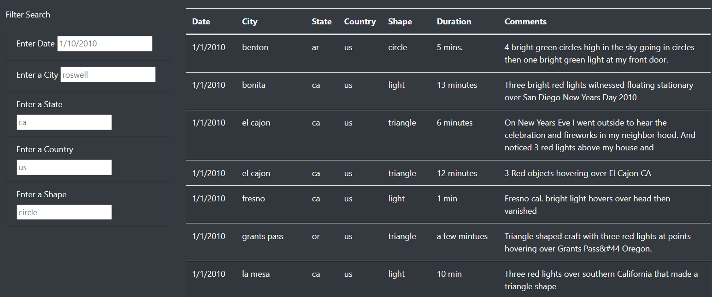
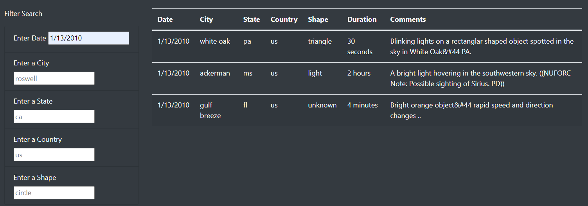
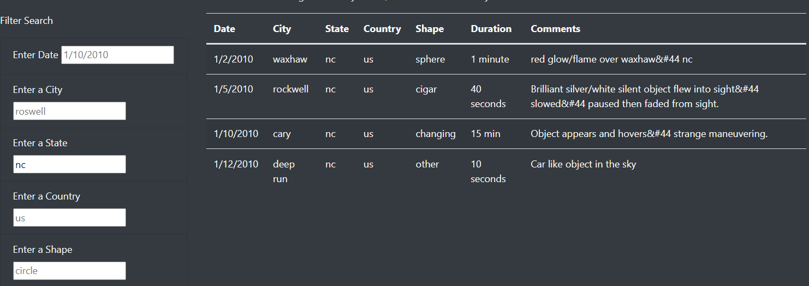
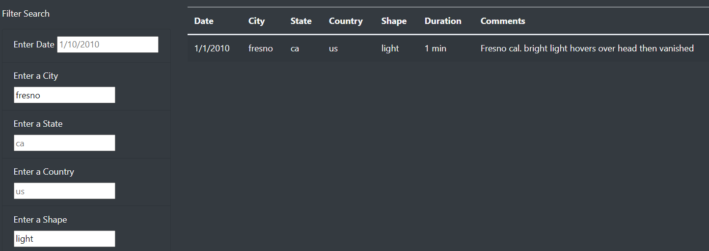
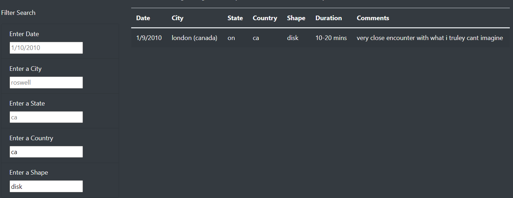
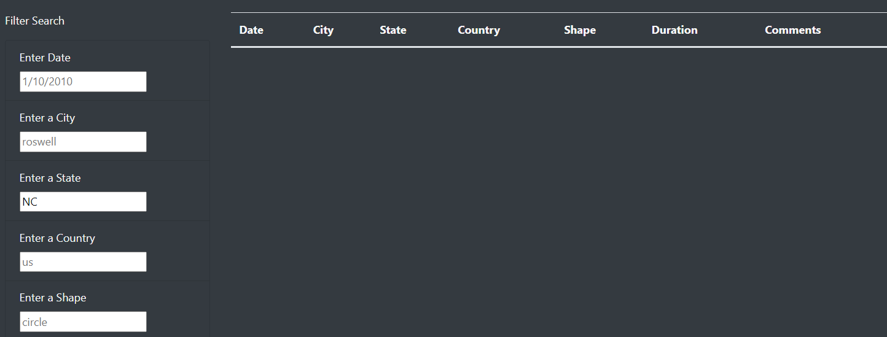

# UFOs

### **Overview of the Project**

The objective of this project to is make a webpage that contains information about UFO sightings across United States and Canada on January 2010. Dana is a data journalist, who wants to write about UFO sightings across the world. She is inspired by UFO sightings and events based on UFO sightings in her hometown of McMinnville, Oregon. She has a JavaScript file filled with information about UFO sighting in different cities, states, countries, shapes of UFO, duration and the dates observed. She wants to use JavaScript's visual functionality to display the information on a table. Dana will post her article online in a tidy HTML page that shows the article, that contains a data table to support her findings. This data table can be further filtered to fine tune the information based on the search criteria from a user input. Otherwise, there is a large amount of data in the table that can be overwhelming to read. We made the webpage for Dana that will showcase the article and table of data that can be filtered based on a search criteria. Finally, we customized the webpage by adding Bootstrap components. 

### **Analysis**

We learned to use JavaScript applied in data visualization, such as making a dynamic webpage. We started with the data  of UFO sightings given in a file _data.js_, which is an array that looks like a python dictionary or a JSON file. We built the webpage the following way:

- Make a storyboard to organize the webpage layout. It is important to make the storyboard before building the webpage to know how different parts of information will fit together. 

- We built the JavaScript table (in the file _app.js_) and the HTML page (in the file _index.html_) simultaneously since the files are closely linked. 

    - We imported the data from the _data.js_ file in the JavaScripts file _app.js_.

    - We pointed the data to HTML page by referencing to the _tbody_ tag using D3 (a JavaScript library).

    - **For the Module 11 practice work:** We defined a function, _buildTable(data)_, cleared any existing data within the table to remove previous search criteria. The previous search table data is cleared by typing *tbody.html("");* . We searched each row of data and saved the value as a cell item in the table, (_td_). The user had to click on a button to initiate a search based on a date. The filtered data is shown in the table. This step is done differently in _Deliverable 1_ (See below).

    - We added Bootstrap components such as "jumbotron" class for an automatic visual enhancement of texts nested within that \
 tag in the HTML file. We used it for the page heading. We also used CSS style sheet for visual enhancement.

    - Bootstrap divides the webpage in container of rows with twelve grids (columns). For one row we used four column width for the article title and eight columns for the article paragraph. We also used the class _container-fluid_ which resize the container to fully fit the width of the browser. 

    - We used a second row with a Bootstrap container with three columns width for the filter box and button. The rest of the  nine columns is used for the table of the UFO sightings data. 

    - Finally, we customized the page adding the CSS components - the background and body color, change the font style and add an image, etc. We created a _style.css_ sheet and the body color and the image for the webpage.  

### **Deliverable 1**

We modified the HTML file _index.html_ and JavaScript files _app.js_ from **Module 11** work to add more table filters with a search criteria based on (i) city, (ii) state, (iii) country and (iv) shape. We kept the date search filter but removed the button to click in the HTML file. Each field has an _id_ the JavaScript file  _app.js_ will locate. The code will iterate through the data from the tableData and filter out the information based on the _id_ and save it and send it back to the HTML file to plot. The summary of the modification is the following:

- We removed the date search button from _index.html_. We then added four more list elements in the HTML file: city, state, country and shape as our search parameter. Each one of these search parameters have an input box with a unique "id" that has the same name as the key in the _data.js_ file. We used this _id_ in  _app.js_ filter as our search parameter. 

- The _app.js_ file had a starter code already written to build the table (_buildTable_) for the UFO database. We updated the code using _updateFilters()_ function. 

- In the _app.js_ file we created an empty variable, _filters_ to store all the variables that changed due to user input. Near the end of the starter code, we added an event listener to detect a "change" of the search parameter due each input from the user. The code is _d3.selectAll("input").on("change", updateFilters)_ . This code will apply the change due to "input" from the HTML file to the filter function, _updateFilters_ in the _app.js_. 

- We created variables for all the elements that changed inside the function _updateFilters_ element and id that changed. They are 
    - _changeElement_ to select the first element that changed. We used the code _d3.select(this)_ to store the value and id.

    - _elementValue_ to hold the value of the _changeElement_  that has changed. 

    - _filterId_ to hold the _id_ attribute of the _changeElement_. 

    - We checked if a value entered has changed the elementValue. In that case we stored it in the _filters_ variable. Otherwise we cleared the filter.
    
    - We created a _filterTable()_ function and looped all the filters and kept only the data that matched the filter value in that function. Finally we rebuilt the table using the filtered data. 

- The last step was to build the table when the page loads. 

### **Results:**

The dynamic webpage constructed is shown in Fig 1 below. This figure does not have user input. The text shown in the box is a placeholder, not the search filter input by the user. A user can enter one or more search criteria in the filter box. Fig 2 - Fig 5 shows the same table with different search criteria. If there is no entry that matches the user criteria, then the table is blank.

**Fig 1.** The image shows a snippet of all the UFO sighting data in the table. 

**Fig 2.** The image shows a search by date, Jan 13, 2010. 

**Fig 3.** The image shows four data entries from the state search nc (North Carolina). 

**Fig 4.** This figure shows the search filtered by state ca (California) and shape light. 

**Fig 5.** The image in this figure is the result of the search by country ca (Canda) and disk shape. 

#### **Summary**

This UFO webpage does a very good job of filtering the data based on the search criteria. However, there are some drawbacks. Following is the list of drawbacks, and recommendation to fix it. I am also suggesting some features that would improve a user's experience.

1. **Drawback and a suggestion to fix it** - All the entries are case sensitive. For example, if the user input is in capital letters, NC (North Carolina), then the table returns empty as shown in Fig 6. One way to fix this issue is to convert all the entries to lower case since the data in _data.js_ is in lower case. 

**Fig 6.** The figure shows the image of the table that returned no result when the search is performed with a capital letter, NC for North Carolina.

2. **Suggestion** - The place holders are confusing for someone who is new to the webpage. It would be better if the color of the box changed to a different color, say light yellow when a user enters a search criteria. Any type of change, such as color of the letter change will also work and be less confusing to a user. 

3. **Suggestion** - Add a menu filter button next to the search box for a user to choose the search item. For example, a user may not know the different shapes of UFO sighting that is available to searching without going through the whole list in the table. 